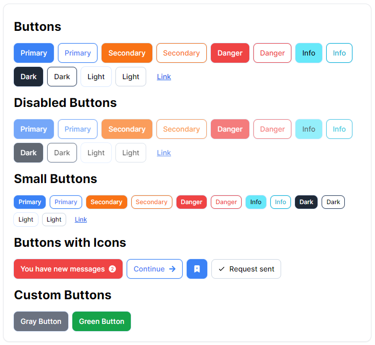
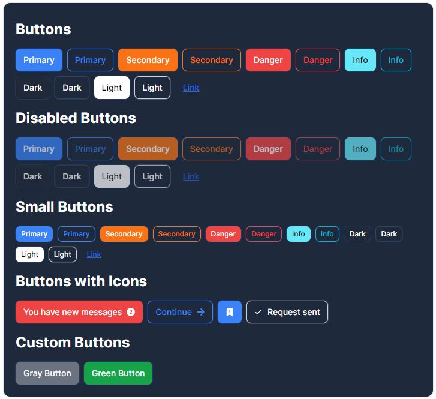
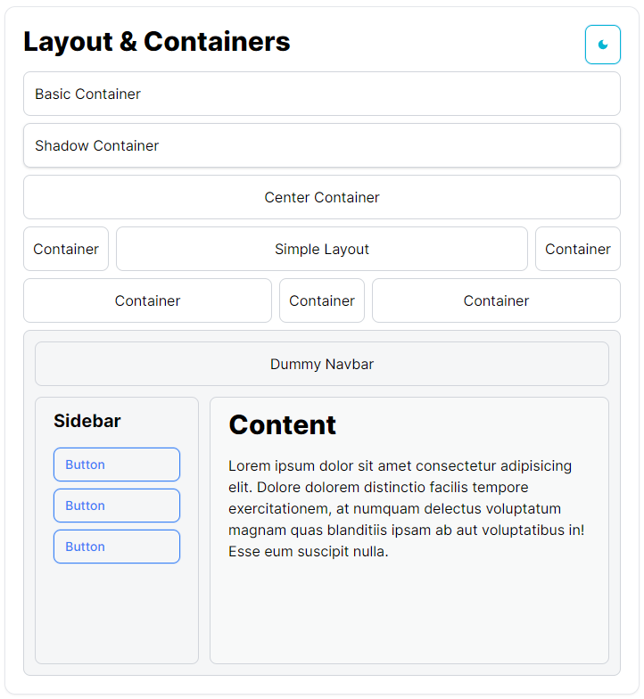

# Tailwind css custom clases like Bootstrap

In this project, I'm trying to recreate bootstrap-like elements, with some custom CSS classes using tailwind's `@layer` and `@apply`, to help make elements and controls faster compared to vanilla tailwind with **only a simple css** file.

*Work in progress...*

### Finished Work

General Body Classes, Buttons and Basic Containers.

## Simple Buttons

## Simple Buttons, Dark Mode compatible

## Simple Buttons, Dark Mode compatible

## Available Scripts

`yarn start` `yarn test` `yarn build`

## Learn More

You can learn more in the [Create React App documentation](https://facebook.github.io/create-react-app/docs/getting-started).

To learn React, check out the [React documentation](https://reactjs.org/).

## Author

Wisaac Softwares (WisaacDev)
