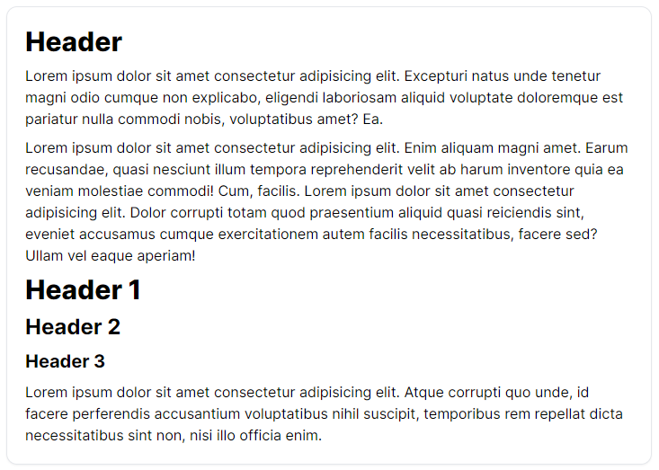

# Tailwind css custom clases like Bootstrap

In this project I'm trying to recreate "bootstrap like" elements, with some custom css clases with `@layer` and `@apply` by tailwind, to help making elements and controls faster than with vanilla tailwind with **only one simple css file**.

*Work in progress...*

### Finished Work

Body General Classes, Buttons.

## Simple Text Layout

## Simple Buttons

## Simple Buttons, Dark Mode compatible

## Available Scripts

`yarn start` `yarn test` `yarn build`

## Learn More

You can learn more in the [Create React App documentation](https://facebook.github.io/create-react-app/docs/getting-started).

To learn React, check out the [React documentation](https://reactjs.org/).

## Author

Wisaac Softwares (WisaacDev)