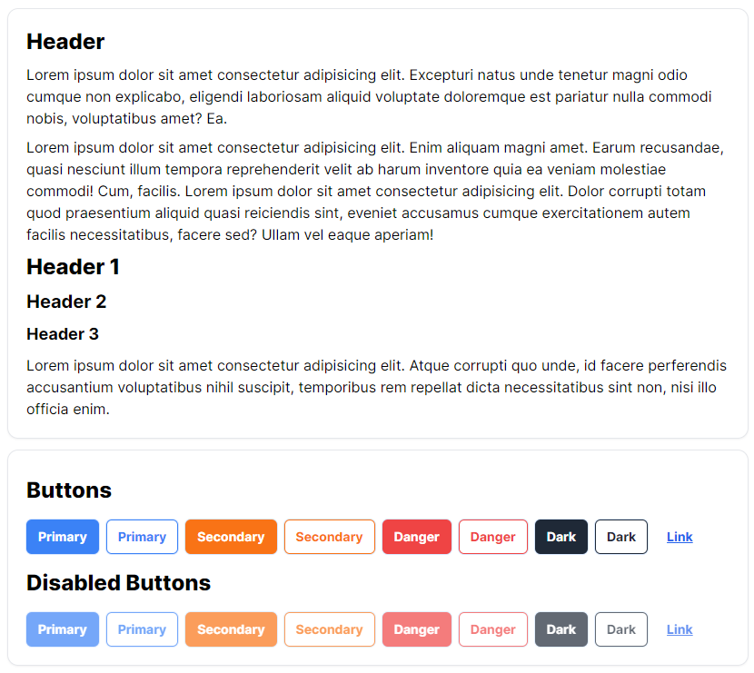

# Tailwind css custom clases like Bootstrap
Making some custom clases with `@layer` and `@apply`, to just like bootstrap make fast controls and components.

Work in progress...

## Available Scripts

### `yarn start`
### `yarn test`
### `yarn build`

## Learn More

You can learn more in the [Create React App documentation](https://facebook.github.io/create-react-app/docs/getting-started).

To learn React, check out the [React documentation](https://reactjs.org/).

## Author

Wisaac Softwares (WisaacDev)